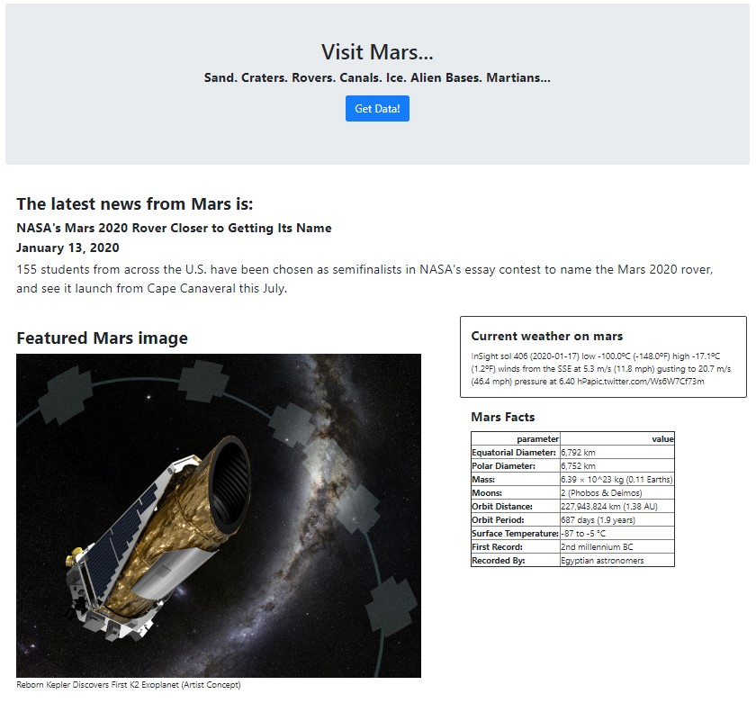
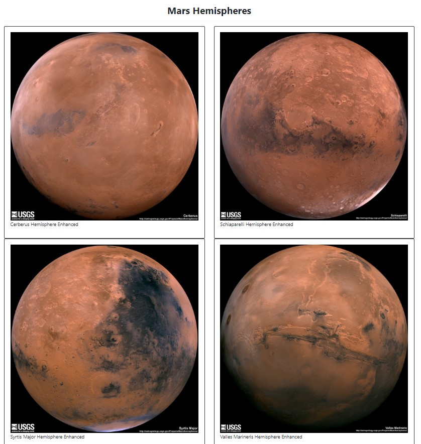

# web-scraping-challenge
## Mission to Mars
### Jim Comas 2020-01-20

## Mission to Mars App Images
### Part 1 

### Part 2

## Files
| Filepath | Description |
|---|---|
|.\Missions_to_Mars\mission_to_mars.ipynb | Jupyter Notebook with trial python code for scraping |
|.\Missions_to_Mars\scrape_mars.py | Python file with scraping functions used in app |
|.\Missions_to_Mars\app.py | Flask app that scrapes websites, places data in MongoDB, renders index.html |
|.\Missions_to_Mars\templates\index.html | HTML page that is renedered by app |
|.\Missions_to_Mars\templates\style.css | CSS style sheet that proved irrelevant in this project |
|.\Missions_to_Mars\images\m2m_page1.jpg | Screen shot of part 1 of Mission to Marge rendered html |
|.\Missions_to_Mars\images\m2m_page2.jpg | Screen shot of part 2 of Mission to Marge rendered html |
